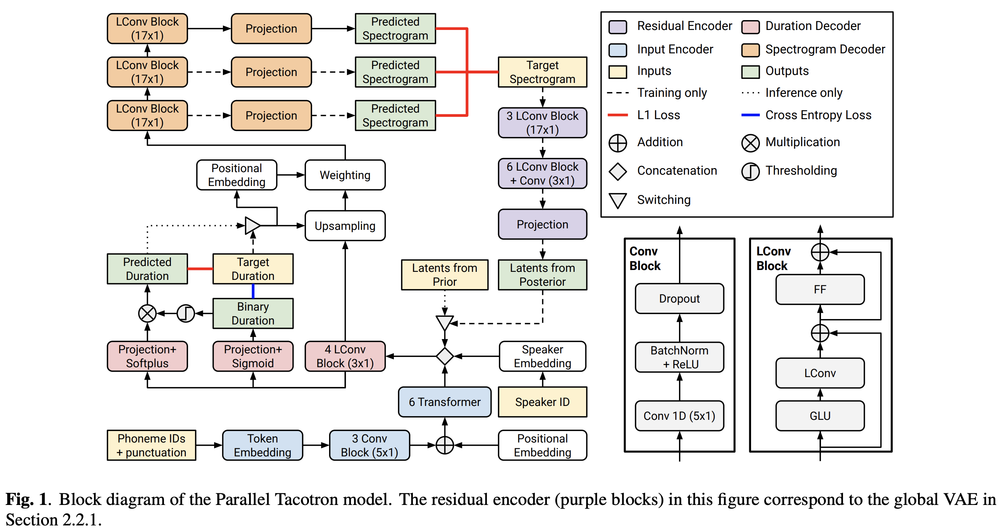
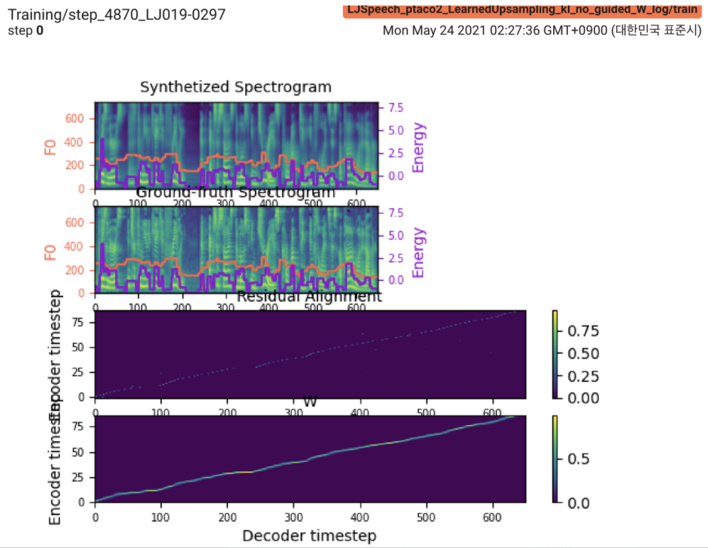

# Parallel Tacotron2

Pytorch Implementation of Google's [Parallel Tacotron 2: A Non-Autoregressive Neural TTS Model with Differentiable Duration Modeling](https://arxiv.org/abs/2103.14574)

<p align="center">
    
</p>

<p align="center">
    
</p>

# Updates
- 2021.05.25: `Only the soft-DTW remains the last hurdle!` Following the author's advice on the implementation, I took several tests on each module one by one under a supervised duration signal with L1 loss (FastSpeech2). Until now, I can confirm that all modules except soft-DTW are working well as follows (Synthesized Spectrogram, GT Spectrogram, Residual Alignment, and W from LearnedUpsampling from top to bottom).

    <p align="center">
        
    </p>

    For the details, please check the latest commit log and the updated Implementation Issues section. Also, you can find the ongoing experiments at [https://github.com/keonlee9420/FastSpeech2/commits/ptaco2](https://github.com/keonlee9420/FastSpeech2/commits/ptaco2).
- 2021.05.15: Implementation done. Sanity checks on training and inference. But still the model cannot converge.

    `I'm waiting for your contribution!` Please inform me if you find any mistakes in my implementation or any valuable advice to train the model successfully. See the Implementation Issues section.

# Training

## Requirements

- You can install the Python dependencies with

    ```bash
    pip3 install -r requirements.txt
    ```

- In addition to that, install fairseq ([official document](https://fairseq.readthedocs.io/en/latest/index.html), [github](https://github.com/pytorch/fairseq)) to utilize `LConvBlock`.

## Datasets

The supported datasets:

- [LJSpeech](https://keithito.com/LJ-Speech-Dataset/): a single-speaker English dataset consists of 13100 short audio clips of a female speaker reading passages from 7 non-fiction books, approximately 24 hours in total.
- (will be added more)

## Preprocessing

After downloading the datasets, set the `corpus_path` in `preprocess.yaml` and run the preparation script:

```
python3 prepare_data.py config/LJSpeech/preprocess.yaml
```

Then, run the preprocessing script:

```
python3 preprocess.py config/LJSpeech/preprocess.yaml
```

## Training

Train your model with

```
python3 train.py -p config/LJSpeech/preprocess.yaml -m config/LJSpeech/model.yaml -t config/LJSpeech/train.yaml
```

The model cannot converge yet. I'm debugging but it would be boosted if your awesome contribution is ready!

# Inference

## Inference

For a single inference, run
```
python3 synthesize.py --text "YOUR_DESIRED_TEXT" --restore_step 900000 --mode single -p config/LJSpeech/preprocess.yaml -m config/LJSpeech/model.yaml -t config/LJSpeech/train.yaml
```
The generated utterances will be saved in `output/result/`.

## Batch Inference

Batch inference is also supported, try
```
python3 synthesize.py --source preprocessed_data/LJSpeech/val.txt --restore_step 900000 --mode batch -p config/LJSpeech/preprocess.yaml -m config/LJSpeech/model.yaml -t config/LJSpeech/train.yaml
```
to synthesize all utterances in `preprocessed_data/LJSpeech/val.txt`.

# TensorBoard

Use

```
tensorboard --logdir output/log/LJSpeech
```

to serve TensorBoard on your localhost.

# Implementation Issues

Overall, normalization or activation, which is not suggested in the original paper, is adequately arranged to prevent NaN value (gradient) on forward and backward calculations. (NaN indicates that something is wrong in the network)

## Text Encoder

1. Use the `FFTBlock` of FastSpeech2 for the transformer block of the text encoder.
2. Use dropout `0.2` for the `ConvBlock` of the text encoder.
3. To restore "proprietary normalization engine",
    - Apply the same text normalization as in FastSpeech2.
    - Implement `grapheme_to_phoneme` function. (See ./text/__init__).

## Residual Encoder

1. Use `80 channels` mel-spectrogrom instead of `128-bin`.
2. Regular sinusoidal positional embedding is used in frame-level instead of combinations of three positional embeddings in Parallel Tacotron. As the model depends entirely on unsupervised learning for the position, this choice can be a reason for the fails on model converge.

## Duration Predictor & Learned Upsampling

1. Use `nn.SiLU()` for the swish activation.
2. When obtaining `W` and `C`, concatenation operation is applied among `S`, `E`, and `V` after frame-domain (T domain) broadcasting of `V`.

## Decoder

1. Use `LConvBlock` and regular sinusoidal positional embedding.
2. Iterative mel-spectrogram is projected by a linear layer.
3. Apply `nn.Tanh()` to each `LConvBLock` output (following activation pattern of decoder part in FastSpeech2).

## Loss

1. Use optimization & scheduler of FastSpeech2 (which is from [Attention is all you need](https://arxiv.org/abs/1706.03762) as described in the original paper).
2. Base on [pytorch-softdtw-cuda](https://github.com/Maghoumi/pytorch-softdtw-cuda) ([post](https://www.codefull.net/2020/05/fast-differentiable-soft-dtw-for-pytorch-using-cuda/)) for the soft-DTW.
    1. Implement customized soft-DTW in `model/soft_dtw_cuda.py`, reflecting the recursion suggested in the original paper.
    2. In the original soft-DTW, the final loss is not assumed and therefore only `E` is computed. But employed as a loss function, jacobian product is added to return target derivetive of `R` w.r.t. input `X`.
    3. Currently, the maximum batch size is `6` in 24GiB GPU (TITAN RTX) due to space complexity problem in soft-DTW Loss.
        - In the original paper, a custom differentiable diagonal band operation was implemented and used to solve the complexity of O(T^2), but this part has not been explored in the current implementation yet.
3. For the stability, mel-spectrogroms are compressed by a sigmoid function before the soft-DTW. If the sigmoid is eliminated, the soft-DTW value is too large, producing NaN in the backward. (Finally, sigmoid should be removed.)

# Citation

```
@misc{lee2021parallel_tacotron2,
  author = {Lee, Keon},
  title = {Parallel-Tacotron2},
  year = {2021},
  publisher = {GitHub},
  journal = {GitHub repository},
  howpublished = {\url{https://github.com/keonlee9420/Parallel-Tacotron2}}
}
```

# References

- [ming024's FastSpeech2](https://github.com/ming024/FastSpeech2) (Later than 2021.02.26 ver.)
- [Parallel Tacotron: Non-Autoregressive and Controllable TTS](https://arxiv.org/abs/2010.11439)
- [Parallel Tacotron 2: A Non-Autoregressive Neural TTS Model with Differentiable Duration Modeling](https://arxiv.org/abs/2103.14574)